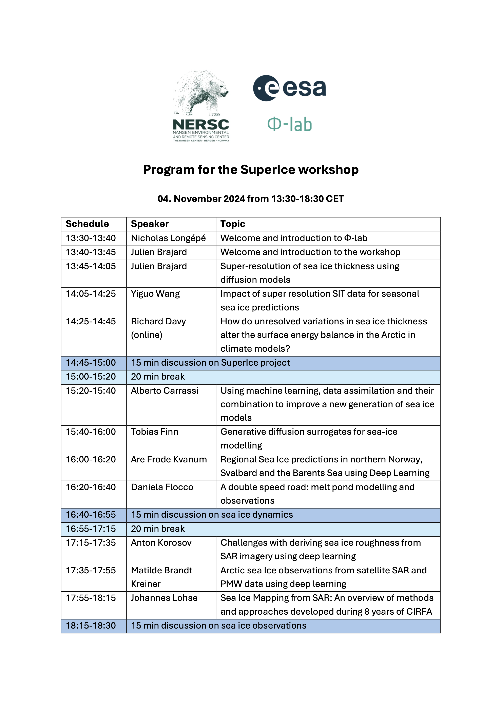

## Objective of the workshop
The objective is to gather a community to discuss SuperIce results and more broadly to draw a picture and perspective on the use of AI in the sea ice.

## Abstracts and slides
Here is the  list of speakers and their abstracts and slides for the SuperIce workshop.

| Name          |    Institution |                                Title and presentation slides |
| ------------- | -------------- | ---------- |
| Julien BRAJARD | NERSC | [Super-resolution of sea ice thickness using diffusion models](assets/abstract_brajard.md) |
| Yiguo WANG | NERSC | [Impact of super resolution SIT data for seasonal sea ice predictions](assets/abstract_wang.md) |
| Richard DAVY | NERSC | [How do unresolved variations in sea ice thickness alter the surface energy balance in the Arctic in climate models](assets/abstract_davy.md) |
| Alberto CARRASSI| Univ. Bologna | [Using machine learning, data assimilation and their combination to improve a new generation of sea ice models](assets/abstract_carrassi.md) |
| Tobias FINN| CEREA | [Generative diffusion surrogates for sea-ice modelling](assets/abstract_finn.md) |
| Are KVANUM| Met. Norway | [Regional Sea Ice predictions in northern Norway, Svalbard and the Barents Sea using Deep Learning](assets/abstract_kvanum.md) |
| Daniela FLOCCO| Univ. Napoli | [A double speed road: melt pond modelling and observations](assets/abstract_flocco.md)|
| Anton KOROSOV | NERSC | [Challenges with deriving sea ice roughness from SAR imagery using deep learning](assets/abstract_korosov.md) |
| Matilde BRANDT KREINER | DMI | [Arctic sea Ice observations from satellite SAR and PMW data using deep learning](assets/abstract_brandt-kreiner_wulf.md) |
| Johannes LOHSE| UiT | [Sea Ice Mapping from SAR: An overview of methods and approaches developed during 8 years of CIRFA](assets/abstract_lohse.md) |

## Funding
SuperIce is a project lead by the [Nansen Environmental and Remote Sensing Center](https://nersc.no/).
SuperIce is funded by the European Space Agency FutureEO programme and supervised by [Φ-lab](https://philab.esa.int/). 
[Here](https://eo4society.esa.int/projects/superice/) is the ESA SuperIce project page.
For any question regarding the workshop please contact <julien.brajard@nersc.no> and <henrike.wilborn@nersc.no>
